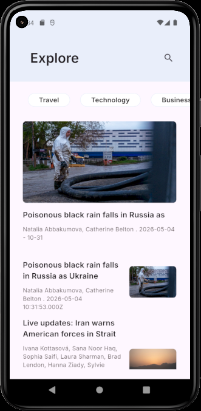
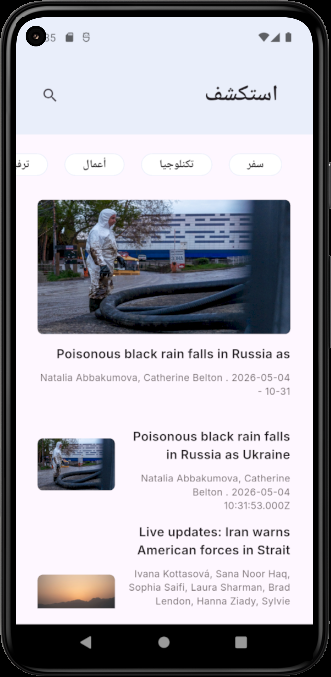

# 📰 News App

A modern Flutter news application that displays the latest headlines, allows users to search for news by keyword, browse categories, and read article details in a clean responsive UI.

The app is built using Flutter and integrates with NewsAPI to fetch real-time news data.

---

## 📱 Features

- Fetch latest top headlines from NewsAPI
- Search for articles by keyword
- Browse news by categories:
  - Travel
  - Technology
  - Business
  - Entertainment
- View full article details
- Cached network images for better performance
- Responsive UI using Flutter ScreenUtil
- Multi-language support using Easy Localization
- Arabic and English localization support
- Clean routing using GoRouter
- Organized feature-based project structure
- Network logging using Pretty Dio Logger
- Cubit for state management

---

## 📸 Screenshots

| Home Screen                                            | Arabic Home                                            | Search Screen                                            |
| ------------------------------------------------------ | ------------------------------------------------------ | -------------------------------------------------------- |
|  |  |  |

| Arabic Search Results                                            | Article Details                                            |
| ---------------------------------------------------------------- | ---------------------------------------------------------- |
|  |  |

---

## 🛠️ Tech Stack

- **Flutter**
- **Dart**
- **Dio** — API requests
- **NewsAPI** — news data source
- **GoRouter** — navigation and routing
- **Easy Localization** — multi-language support
- **Flutter ScreenUtil** — responsive design
- **Cached Network Image** — image caching
- **Google Fonts**
- **Intl**
- **Pretty Dio Logger**
- **Bloc** — state management

---

## 📁 Project Structure

```txt
lib/
├── main.dart
│
├── core/
│   ├── constantes/
│   │   └── constantes.dart
│   │
│   ├── networking/
│   │   ├── api_end_points.dart
│   │   └── dio_helper.dart
│   │
│   ├── routing/
│   │   ├── app_routes.dart
│   │   └── router_generator_config.dart
│   │
│   ├── styles/
│   │   ├── app_colors.dart
│   │   ├── app_fonts.dart
│   │   └── app_text_style.dart
│   │
│   └── widgets/
│       ├── primary_text_field.dart
│       └── spacing_widgets.dart
│
└── features/
    ├── home_screen/
    │   ├── cubit/
    │   │   ├── home_cubit.dart
    │   │   └── home_states.dart
    │   │
    │   ├── models/
    │   │   └── top_head_lines_model.dart
    │   │
    │   ├── repo/
    │   │   └── home_repo.dart
    │   │
    │   ├── widgets/
    │   │   ├── article_card_widget.dart
    │   │   ├── custom_category_item_widget.dart
    │   │   ├── search_text_field_widget.dart
    │   │   └── top_headline_widget.dart
    │   │
    │   └── home_screen.dart
    │
    ├── search_result_screen/
    │   ├── cubit/
    │   │   ├── search_cubit.dart
    │   │   └── search_states.dart
    │   │
    │   ├── repo/
    │   │   └── search_result_repo.dart
    │   │
    │   └── search_result_screen.dart
    │
    └── artical_details_screen/
        └── artical_details_screen.dart
---
___


## 🚀 Getting Started

### 1. Clone the repository

```bash
git clone https://github.com/rimonnnn/news_app.git
```

### 2. Navigate to the project folder

```bash
cd news_app
```

### 3. Install dependencies

```bash
flutter pub get
```

### 4. Run the app

```bash
flutter run
```

---

## 🔑 API Configuration

This app uses [NewsAPI](https://newsapi.org/) to fetch news articles.

The API base URL used in the project:

```text
https://newsapi.org/v2/
```

Main endpoints:

```text
top-headlines
everything
```

> Important: For production or public repositories, do not hardcode your API key inside the source code. Use environment variables or a secure configuration file instead.

---

## 🌍 Localization

The app supports localization using `easy_localization`.

Supported languages:

- English
- Arabic

Translation files are located in:

```text
assets/translations/
```

---

## 🧭 App Flow

```text
Home Screen
    ├── Displays latest top headlines
    ├── Shows article cards
    ├── Provides category navigation
    └── Allows search by keyword

Search Result Screen
    └── Displays articles based on user search query

Article Details Screen
    └── Shows article image, title, author, date, and description
```

---

## 📦 Dependencies

```yaml
dependencies: cached_network_image
  dio
  easy_localization
  flutter_screenutil
  go_router
  google_fonts
  intl
  pretty_dio_logger
  flutter_bloc
```

---

## 📌 Screens

### Home Screen

Displays latest news headlines and category shortcuts.

### Search Results Screen

Shows articles based on the searched keyword or selected category.

### Article Details Screen

Displays detailed information about the selected article.

---

## ⚙️ Main Functionalities

### Fetch Top Headlines

The app sends a GET request to the `top-headlines` endpoint and retrieves the latest news based on country.

### Search News

The app sends a GET request to the `everything` endpoint using the user search query.

### Article Navigation

When the user taps on an article card, the selected article object is passed to the details screen using GoRouter.

---

## 🧪 Future Improvements


- Add saved/bookmarked articles
- Add dark mode
- Add better error UI
- Add loading skeletons
- Move API key to environment variables
- Add pagination for large result sets
- Add unit and widget tests
- Add article sharing feature
- Open full article source link in browser

---

## 👨‍💻 Author

**Rimon Abdelmasih**

- GitHub: [rimonnnn](https://github.com/rimonnnn)
- LinkedIn: [Rimon Abdelmasih](https://www.linkedin.com/in/rimon-abdelmasih)
- Portfolio: [rimonnnn.github.io](https://rimonnnn.github.io/)

---

## 📄 License

This project is open source and available for learning and portfolio purposes.
